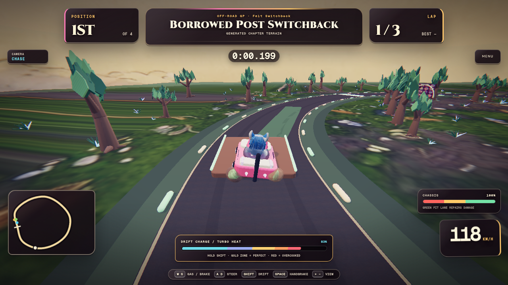
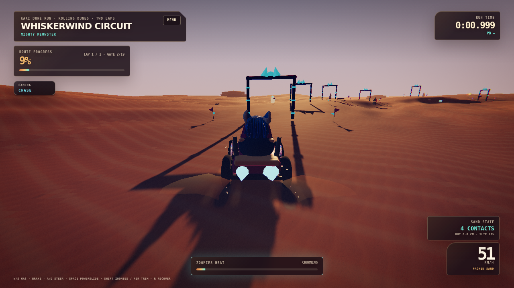
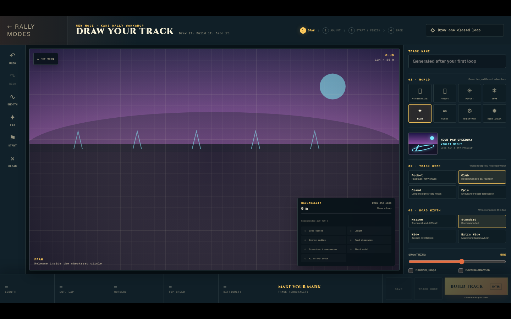
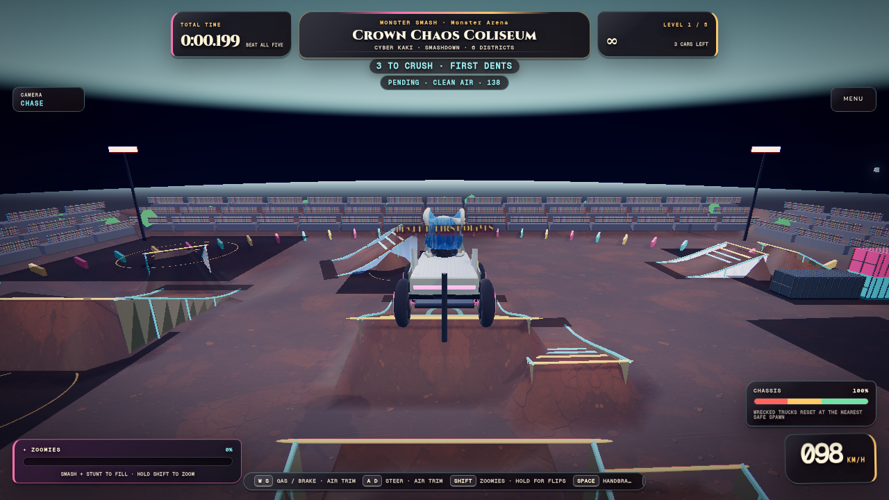
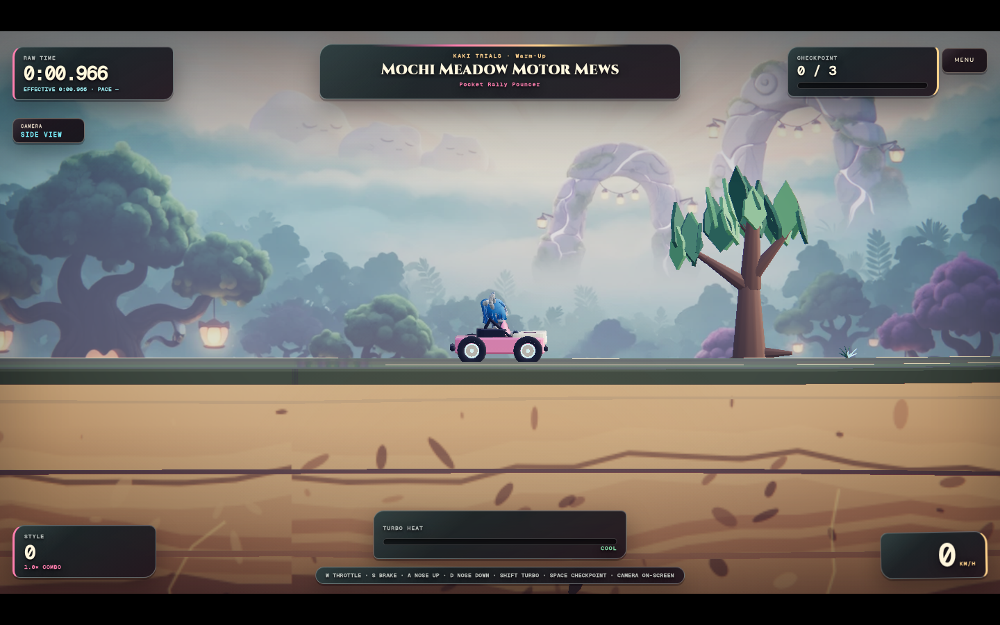

# Kaki Rally

**Race it. Draw it. Wreck it.**

[Play Kaki Rally](https://dknos.github.io/kaki-rally/) ·
[Source project](https://github.com/dknos/Kaki-Survivors-2) ·
[Report a bug](https://github.com/dknos/kaki-rally/issues)



Kaki Rally is the complete standalone home for the racing games originally
built inside Kaki-Survivors-2. It preserves the authored handling, fixed-step
physics, courses, vehicles, camera rigs, records, track-code formats, ghosts,
destruction systems, and renderer abstraction while removing the Survivors
combat runtime from the production dependency graph.

## Modes

| Mode | What is preserved |
| --- | --- |
| **Off-Road GP** | Circuit racing, six venues, AI grids, laps, checkpoints, damage, repairs, ramps, shortcuts, surface handling, and three camera rigs |
| **Drift Attack** | Charged drifting, independent drift handling, mini-turbo release, 90-second scoring, combos, and per-course records |
| **Kaki Stock Cup** | Oval configurations, up to 16 cars, drafting, pack impacts, visible damage, smoke, and repairs |
| **Draw Your Track** | Mouse/touch/controller editor, Pocket through Colossal sizes, road widths, elevation, banking, expert overlays, exact multi-overpasses, AI paths, checkpoints, respawns, features, reverse, mirror, themes, gallery, and KDT1/KDT2/KDT3 codes |
| **Monster Smash** | Smashdown, Freestyle, Free Ride, five-round progression, crush/collapse systems, stunts, wreck chains, Zoomies, route ghosts, and Mighty Meowster, Cyber Kaki, and Tipsy Tumbler |
| **Kaki Dune Run** | Four seeded desert events with authored crest/landing/bank rhythm, a shared renderer/physics heightfield, nested-ring terrain, four-wheel load/slip/sinkage, persistent ruts and berms, ballistic sand and swept wakes, records/ghosts, recovery, three monster trucks, and custom Dune-theme Workshop routes |
| **Kaki Trials** | Three point-to-point courses, real gaps, pitch control, turbo heat, checkpoints, destruction, medals, unlocks, and validated personal-best ghosts |

Kaki Catastrophe is a frozen experiment, not a production mode. Its source and
assets remain for a future extraction decision, but it is hidden from normal
navigation and does not load Rapier or Catastrophe assets during ordinary play.

The six rally venues are **Borrowed Post Switchback**, **Nobody’s Turn**,
**Kiln-Shift Circuit**, **Quiet Toll Run**, **Glass Mile**, and
**Chalkline Loop**.

Rally, drift, stock, and generated Draw Track courses use the Terra-STL grass
system: deterministic carpet and emergent clumps, venue-specific palettes,
road-cleared placement, distance thinning, and tip-weighted wind. The same TSL
material runs on WebGL and WebGPU; display quality scales the instance budget,
and reduced-motion disables wind without removing the landscape layer.

Kaki Dune Run contains **Whiskerwind Circuit**, **Sunspine Ridge Run**,
**Mirage Mile**, and the freeride **Big Litterbox**. Its seeded CPU heightfield
is uploaded once and sampled by both fixed-step wheel physics and TSL terrain;
the local deformation field then supplies the same bounded depression,
displaced berm, and compaction state to both. Selecting the Dune theme in Draw
Your Track turns the validated route, elevation/banking profile, and compatible
stamps into a deterministic custom Dune event without changing KDT storage.

## Controls

Keyboard and gamepad controls are remappable through the browser/OS input
layer; touch controls appear automatically on coarse-pointer devices.

| Context | Keyboard |
| --- | --- |
| Rally / Drift / Stock | `W`/`S` throttle and brake, `A`/`D` steer, `Shift` drift, `Space` handbrake, on-screen camera selector |
| Monster Smash | `W`/`S` drive and air trim, `A`/`D` steer and air trim, hold `Shift` for Zoomies/flips, `Space` handbrake, `R` recover, `F` refill in Free Ride |
| Kaki Dune Run | `W`/`S` throttle/brake and air trim, `A`/`D` steer/lean, `Space` powerslide, `Shift` Zoomies, `R` recover; touch adds Slide, Zoomies, and Recover |
| Kaki Trials | `W` throttle, `S` brake/reverse, `A` nose up, `D` nose down, `Shift` turbo, `Space` restart from checkpoint |
| Draw Your Track | Draw with pointer/touch, use the labeled workshop tools, hold `Space` to pan; controller moves the workshop cursor and activates with the primary button |
| Everywhere | `Escape` / gamepad B pauses, backs out, or returns to the Kaki Rally menu; `F3` toggles the developer diagnostics overlay |

## Renderer support

WebGL 2 is the stable default. WebGPU remains selectable and is exercised by
the browser matrix for all seven production modes.

- Force WebGL: `?renderer=webgl`
- Request WebGPU: `?renderer=webgpu`
- Deep link: `?mode=dunes`, `?mode=monster`, `?mode=trials`, `?mode=draw`, and so on
- Deep link and launch immediately: add `&play=1`

If WebGPU initialization fails, Kaki Rally rebuilds the canvas with WebGL and
shows the fallback in renderer diagnostics. The frozen Catastrophe experiment
can be reached only during local development with `?dev=catastrophe`; it
remains WebGL-only and dynamically loads only after that explicit request.

## Saves and portability

Kaki Rally continues to read and write the original local-storage keys:

```text
kks_rally_best_v1
kks_draw_tracks_v1
kks_monster_records_v1
kks_dune_records_v1
kks_rally_trials_v1
kks_kaki_catastrophe_records_v1
```

Nothing is silently deleted or converted. Existing Draw Track libraries and
KDT1/KDT2 codes remain readable; bounded elevation/banking is an optional KDT3
extension. The Records screen can export all rally data
as a single JSON file, import it with an automatic backup, or separately reset
records, Draw Track creations, or all progress. Every destructive reset
requires confirmation.

## Local development

Requires Node.js 20 or newer.

```bash
npm ci
npm run serve
```

Open `http://127.0.0.1:4173/`. The game is intentionally bundler-free, so the
same relative files run locally and under `/kaki-rally/` on GitHub Pages.

## Validation

```bash
npm test                    # deterministic renderer, racing, boundary, save, and asset suites
npm run test:catastrophe    # optional frozen-experiment suite
npm run test:browser        # full WebGL/WebGPU interaction matrix
npm run test:browser:dunes  # focused Dune lifecycle/events/Workshop/parity pass
npm run qa:performance      # warmed 25-session lifecycle/leak benchmark
npm run qa:performance:hardware # native physical-adapter benchmark gate
npm run assets:inventory    # regenerate path/size/SHA-256 inventory
npm run vendor:check        # verify the focused Three.js runtime closure
npm run test:production-assets -- https://dknos.github.io/kaki-rally/
```

The checked-in evidence is in [docs/QA_REPORT.md](docs/QA_REPORT.md),
[docs/PERFORMANCE.md](docs/PERFORMANCE.md),
[docs/DUNE_RUN_BASELINE.md](docs/DUNE_RUN_BASELINE.md),
[docs/DUNE_RUN_PERFORMANCE.md](docs/DUNE_RUN_PERFORMANCE.md), and `docs/qa/`. Browser automation
uses emulated touch and the Gamepad API; physical-phone thermals, frame pacing,
and individual controller mappings still require human hardware review.

## Screenshots

| Kaki Dune Run | Draw Your Track |
| --- | --- |
|  |  |

| Monster Smash | Kaki Trials |
| --- | --- |
|  |  |

## Project and licenses

Kaki Rally was extracted from
[Kaki-Survivors-2](https://github.com/dknos/Kaki-Survivors-2) at the exact
commit recorded in [SOURCE_BASELINE.md](SOURCE_BASELINE.md). Code is MIT
licensed. Third-party and generated-asset provenance is preserved in
[CREDITS.md](CREDITS.md) and
[THIRD_PARTY_NOTICES.md](THIRD_PARTY_NOTICES.md); those assets and research
sources retain their own licenses.

Architecture and safe upstream-sync instructions are documented in
[docs/ARCHITECTURE.md](docs/ARCHITECTURE.md) and
[docs/UPSTREAM_SYNC.md](docs/UPSTREAM_SYNC.md).

## Local Gauntlet Wave 1

The 2026-07-30 local implementation wave extends the existing production
graph without adding a renderer or parallel session engine:

- Drift Attack now has the three-car Needle / Comet / Monarch fleet, three
  Whisker Yard layouts, per-car handling profiles, and a judged line/angle/
  speed/style score.
- Kaki Stock Cup now exposes the original Kaki Thunderbowl in concrete and
  clay configurations. Banking is sampled by both track mesh and contact
  physics, while grip, drag, groove, pack presentation, and dirt dressing
  change with the selected surface.
- Kaki Dune Run now contains the Kaki Rally Raid expedition layer: four
  authored selective stages, three rally-raid vehicle archetypes, roadbook
  assists, waypoint/speed penalties, cumulative results, and service choice.

Focused evidence and known limitations are kept in
[docs/gauntlet-progress.html](docs/gauntlet-progress.html),
[docs/QA_REPORT.md](docs/QA_REPORT.md), and `docs/qa/`. This is a local
working-tree wave; it has not been pushed or deployed. SwiftShader browser
captures are functional evidence only and do not replace the native RTX
5080, controller, phone, or human art/audio gates.
